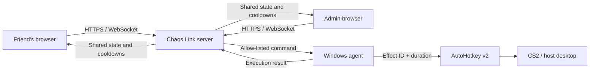

<strong>This English page is a project overview. Use the <a href="README.md">Russian README</a> for the current setup and operating instructions.</strong>

# Chaos Link

**Let your friends sabotage your CS2 session from their phones in real time.**

## Easy setup — three steps

1. **[Download ChaosLink-Setup.exe](https://github.com/egore4606/chaos-link/releases/latest/download/ChaosLink-Setup.exe)** from the latest release.
2. Run the normal setup wizard. Installation is fully offline: .NET, AutoHotkey, and `cloudflared` are already inside the EXE.
3. Start Chaos Link from its shortcut and send your friends the displayed site URL, room code, and **friends password**. Normal startup no longer requires a UAC prompt.

The Start menu provides Start, Stop, Files, and Uninstall actions; desktop shortcuts are optional in the wizard. The live console accepts `status`, `info`, `restart`, `stop`, `folder`, and `help`.

> [!CAUTION]
> Do not disable Microsoft Defender or Chrome Safe Browsing. Until releases use a trusted publisher certificate, Windows may warn that a new executable has an unknown publisher. Download only from this repository's Releases page and compare its SHA-256 value with `SHA256SUMS.txt`. See [build trust and code signing](docs/TRUST_AND_SIGNING.md).

Chaos Link turns an ordinary game with friends into a shared chaos challenge. Run it on the consenting player's Windows PC, send the room link to friends, and let them make the match harder from their phones: force a jump or reload, draw the knife, jerk the aim, block movement, flash the screen, or trigger a random screamer. Everyone sees the same cooldowns in real time.

> [!IMPORTANT]
> Chaos Link intentionally affects keyboard, mouse, screen, and audio input on the host PC. Install and run it only with the gaming-PC owner's informed permission. It has no autostart, hidden service, remote shell, DLL injection, or game-memory access.

## Main features

- Any number of browser controllers in one room
- Shared server-authoritative cooldowns
- Admin pause, per-effect cooldown settings, and timed, permanent, or manually released guest blocks
- Eleven allow-listed AutoHotkey v2 effects, including fire blocking and a grenade-under-feet sequence
- User-managed random screamer images and sounds
- LAN access and an optional temporary Cloudflare Quick Tunnel
- One-file offline Windows installer with Start, Stop, and Uninstall shortcuts
- Emergency input release from the admin panel or `Ctrl+Shift+F12`

## Architecture

The browser authenticates to the ASP.NET Core server. The server validates the room and role, serializes state changes, and forwards accepted effect IDs to the single gaming-PC agent. The browser never communicates with AutoHotkey directly.

The installer supports Russian and English; the application console is currently in Russian, and the web dashboard can switch between Russian and English. The installer supports 64-bit Windows 10 (1607+) and Windows 11 and needs internet only when starting the public tunnel. Detailed requirements, development commands, effect descriptions, security notes, and support instructions are maintained in the [primary Russian README](README.md).

> [!NOTE]
> The generated `https://*.trycloudflare.com` address changes after each restart. Cloudflare Quick Tunnels are intended for temporary sessions, not permanent production hosting.

No open-source license has been granted yet. Unless a license is added, the repository remains publicly viewable source with all rights reserved by its owner.
