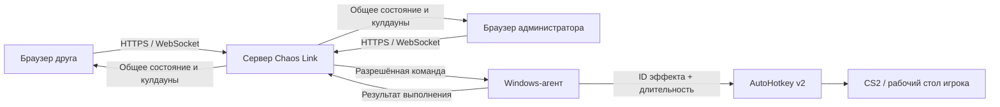

# Chaos Link

**Позвольте друзьям мешать вам играть в CS2 прямо со своих телефонов.**

[English version](README.en.md)

[](https://github.com/egore4606/chaos-link/actions/workflows/ci.yml)
[](https://github.com/egore4606/chaos-link/releases/latest)
[](#требования)

## Простая установка — три шага

1. **[Скачайте ChaosLink-Setup.exe](https://github.com/egore4606/chaos-link/releases/latest/download/ChaosLink-Setup.exe)** из последнего релиза.
2. Запустите файл и пройдите обычный мастер установки. Интернет для установки не нужен: .NET, AutoHotkey и `cloudflared` уже находятся внутри EXE.
3. Запустите Chaos Link ярлыком. Подтвердите запрос Windows для игрового агента, затем скопируйте из консоли сайт, код комнаты и **пароль друзей**.

В меню «Пуск» появятся все команды программы. Если оставить выбранной соответствующую опцию мастера, основные ярлыки также появятся на рабочем столе:

- `Chaos Link - Start` — запустить систему и открыть живые логи;
- `Chaos Link - Stop` — полностью остановить сервер, агент и временный туннель;
- `Chaos Link - Files` — открыть папки программы и скримеров;
- `Chaos Link - Uninstall` — полностью удалить Chaos Link.

В открытой консоли можно вводить `status`, `info`, `restart`, `stop`, `folder` или `help`. Команда `info` повторно показывает ссылку и пароли, а `restart` перезапускает сервер и агент без смены текущего туннеля.

> [!CAUTION]
> Не отключайте Microsoft Defender или Chrome Safe Browsing ради установки. До появления доверенной цифровой подписи Windows может показывать предупреждение «неизвестный издатель» для нового EXE. Скачивайте файл только из раздела Releases этого репозитория и сверяйте SHA-256 с `SHA256SUMS.txt` из того же релиза. Подробнее: [доверие к сборкам и цифровая подпись](docs/TRUST_AND_SIGNING.md).

Chaos Link превращает обычную игру с друзьями в совместное испытание хаосом. Программа запускается на Windows-компьютере согласившегося игрока. Вы отправляете друзьям ссылку на комнату, а они с телефонов или из браузера могут в самый неподходящий момент заставить игрока прыгнуть или перезарядиться, достать нож, резко дёрнуть прицел, заблокировать движение, ослепить экран или включить случайный скример. Все видят общие кулдауны, поэтому друзья играют против «жертвы» вместе, а не нажимают несвязанные кнопки.

> [!IMPORTANT]
> Chaos Link намеренно воздействует на клавиатуру, мышь, экран и звук компьютера игрока. Устанавливайте и запускайте его только с осознанного разрешения владельца компьютера. В программе нет автозапуска, скрытой службы, удалённой командной строки, DLL-инъекций или доступа к памяти игры.


## Что могут делать друзья

- Подключать к одной комнате любое количество браузеров
- Видеть общие серверные кулдауны в реальном времени
- Ставить систему на паузу, менять кулдауны эффектов и блокировать гостя на 30 секунд или до ручной разблокировки
- Запускать одиннадцать разрешённых эффектов через AutoHotkey v2
- Использовать случайные изображения и звуки скримеров из собственных папок
- Подключаться по локальной сети или через временный Cloudflare Quick Tunnel
- Устанавливать всё одним Windows-файлом с ярлыками запуска, остановки и удаления
- Экстренно освобождать ввод из админ-панели или сочетанием `Ctrl+Shift+F12`

## Как это работает



Браузер никогда не обращается к AutoHotkey напрямую. Он авторизуется на сервере ASP.NET Core, который проверяет комнату и роль, последовательно обрабатывает изменения состояния и передаёт разрешённые ID эффектов единственному агенту игрового компьютера. Примеры сообщений приведены в описании [протокола WebSocket](docs/protocol.md).

## После установки

Установщик размещает самодостаточные приложения .NET, AutoHotkey v2 и зафиксированную версию `cloudflared` в `%LOCALAPPDATA%\ChaosLink`. Во время сборки сторонние файлы проверяются по SHA-256; на компьютере пользователя сетевые загрузки не выполняются. Обновление сохраняет комнату и ключи доступа. Установщик не добавляет программу в автозагрузку и не создаёт службу Windows. Никому не передавайте **пароль администратора**: друзьям нужен только **пароль друзей**.

Стандартный журнал мастера создаётся в `%TEMP%` с именем `Setup Log*.txt`, а журнал первоначальной настройки после успешной установки находится в `%LOCALAPPDATA%\ChaosLink\runtime\install-bootstrap.log`. Если мастер сообщает об ошибке, приложите оба файла к обращению в поддержку.

Удалить программу можно через «Установленные приложения» Windows или ярлык «Удалить Chaos Link» в меню «Пуск». Деинсталлятор остановит процессы Chaos Link, удалит его правило брандмауэра, ярлыки, настройки и пользовательские файлы скримеров.

> [!NOTE]
> Адрес вида `https://*.trycloudflare.com` меняется после каждого перезапуска. Cloudflare Quick Tunnels подходят для временных игровых сессий, а не для постоянного хостинга.

## Требования

### Готовый установщик

- 64-разрядный компьютер с Windows 10 (1607+) или Windows 11
- Интернет только при запуске публичного Cloudflare Tunnel; установка полностью офлайн
- Возможность подтвердить один запрос UAC для агента ввода и правила локальной сети в брандмауэре
- Современный браузер на каждом управляющем устройстве

### Разработка

- [.NET SDK 9](https://dotnet.microsoft.com/download/dotnet/9.0)
- [Node.js 20 or newer](https://nodejs.org/)
- [AutoHotkey v2](https://www.autohotkey.com/) на игровом компьютере

## Настройка для разработки

Сборка веб-приложения:

```powershell
cd apps/web
npm ci
npm run lint
npm run build
```

Сборка решения .NET:

```powershell
cd ../..
dotnet restore ChaosLink.sln
dotnet build ChaosLink.sln --configuration Release --no-restore
```

Запуск сервера и агента в отдельных терминалах:

```powershell
dotnet run --project apps/server --urls http://0.0.0.0:5075
dotnet run --project apps/agent
```

На этом компьютере откройте `http://localhost:5075`, а в той же локальной сети — `http://<gaming-pc-ip>:5075`.

Настройки в репозитории содержат только тестовые данные для разработки:

| Роль | Тестовое значение | Ключ настройки |
| --- | --- | --- |
| Комната | `K7M2` | `ChaosLink:RoomCode` |
| Гость | `friend-access` | `ChaosLink:ControllerToken` |
| Администратор | `admin-access` | `ChaosLink:AdminToken` |
| Агент | `agent-secret` | `ChaosLink:AgentToken` |

> [!WARNING]
> Замените все тестовые значения перед публикацией сервера, настроенного вручную. Установщик из релиза автоматически создаёт новые случайные значения. Браузер хранит ключи только в хранилище текущей сессии.

## Эффекты и управление

| Группа | Эффекты |
| --- | --- |
| Быстрые действия | Достать нож, перезарядиться, прыгнуть, выбросить оружие |
| Управление | Дёрнуть мышь, удерживать Ctrl, заблокировать WASD или ЛКМ, кинуть гранату под себя |
| Экран и звук | Белая вспышка, случайный скример |

Добавляйте свои файлы в установленные папки `screamer\images` и `screamer\sounds`. При активации приложение независимо выбирает случайные изображение и звук; если папки пусты, используется встроенный вариант.

Администратор может поставить все эффекты на паузу, заблокировать подключённого гостя на 30 секунд или до ручной разблокировки и установить общие кулдауны от 0 до 3600 секунд. Для экстренного освобождения удерживаемых клавиш и временных блокировок нажмите `Ctrl+Shift+F12` на игровом компьютере.

## Сборка установщика Windows

```powershell
.\scripts\build-portable-installer.ps1
```

Сборка требует Inno Setup 6.7+ и создаёт единый `dist\ChaosLink-Setup.exe`. В него входят самодостаточные сборки .NET и проверенные по SHA-256 версии AutoHotkey и `cloudflared`. Сеть используется только на машине сборки; готовый EXE устанавливается офлайн.

Ручное локальное развёртывание с новыми учётными данными:

```powershell
.\scripts\publish-chaos-link.ps1
.\scripts\start-chaos-link.ps1
# позже
.\scripts\stop-chaos-link.ps1
```

Рабочие учётные данные сохраняются в `.runtime/access.json`; этот файл исключён из Git. В установленной версии их также можно увидеть командой `info` в управляющей консоли.

## Проверка

При запущенном сервере:

```powershell
node scripts/smoke-test.mjs
```

Smoke-тест подключает одного агента и два контроллера, запускает эффект, проверяет одинаковый кулдаун у обоих контроллеров и убеждается, что немедленный повторный запуск отклонён.

## Безопасность и правила игры

Chaos Link использует отдельные общие токены для каждой роли и список разрешённых идентификаторов эффектов. Не публикуйте отдельно адрес агента, не передавайте ключ администратора или агента и не добавляйте рабочие файлы в Git. Перед публикацией сервера или сообщением об уязвимости прочитайте [SECURITY.md](SECURITY.md).

Правила игры и платформы могут меняться, а сторонняя автоматизация ввода не гарантирует совместимость с античитом. Предпочитайте закрытые или пользовательские игры, не отключайте Trusted Mode в CS2 и останавливайте программу там, где автоматизация запрещена.

## Структура проекта

```text
apps/server/     WebSocket-сервер ASP.NET Core и состояние комнаты
apps/web/        Адаптивная панель управления на React + Vite
apps/agent/      .NET-агент игрового компьютера
ahk/             Обработчик разрешённых эффектов на AutoHotkey v2
installer/       Прозрачный переносимый установщик Windows
scripts/         Сборка, запуск, остановка и smoke-тесты
docs/            Описание протокола и изображение интерфейса
```

## Участие в разработке и поддержка

Сообщения о воспроизводимых ошибках и точечные улучшения приветствуются. Прочитайте [CONTRIBUTING.md](CONTRIBUTING.md), создавайте [GitHub Issues](https://github.com/egore4606/chaos-link/issues) для ошибок и предложений, а по вопросам использования обращайтесь к [SUPPORT.md](SUPPORT.md).

Открытая лицензия пока не предоставлена. Пока она не добавлена, исходный код доступен для просмотра, но все права сохраняются за владельцем репозитория.
