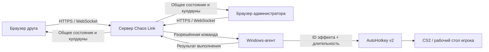

# Chaos Link

**Позвольте друзьям мешать вам играть в CS2 прямо со своих телефонов.**

[English version](README.en.md)

[](https://github.com/egore4606/chaos-link/actions/workflows/ci.yml)
[](https://github.com/egore4606/chaos-link/releases/latest)
[](#требования)

Chaos Link превращает обычную игру с друзьями в совместное испытание хаосом. Программа запускается на Windows-компьютере согласившегося игрока. Вы отправляете друзьям ссылку на комнату, а они с телефонов или из браузера могут в самый неподходящий момент заставить игрока прыгнуть или перезарядиться, достать нож, резко дёрнуть прицел, заблокировать движение, ослепить экран или включить случайный скример. Все видят общие кулдауны, поэтому друзья играют против «жертвы» вместе, а не нажимают несвязанные кнопки.

> [!IMPORTANT]
> Chaos Link намеренно воздействует на клавиатуру, мышь, экран и звук компьютера игрока. Устанавливайте и запускайте его только с осознанного разрешения владельца компьютера. В программе нет автозапуска, скрытой службы, удалённой командной строки, DLL-инъекций или доступа к памяти игры.


## Что могут делать друзья

- Подключать к одной комнате любое количество браузеров
- Видеть общие серверные кулдауны в реальном времени
- Ставить систему на паузу, менять кулдауны эффектов и блокировать гостя на 30 секунд или до ручной разблокировки
- Запускать одиннадцать разрешённых эффектов через AutoHotkey v2
- Использовать случайные изображения и звуки скримеров из собственных папок
- Подключаться по локальной сети или через временный Cloudflare Quick Tunnel
- Устанавливать всё одним Windows-файлом с ярлыками запуска, остановки и удаления
- Экстренно освобождать ввод из админ-панели или сочетанием `Ctrl+Shift+F12`

## Как это работает



Браузер никогда не обращается к AutoHotkey напрямую. Он авторизуется на сервере ASP.NET Core, который проверяет комнату и роль, последовательно обрабатывает изменения состояния и передаёт разрешённые ID эффектов единственному агенту игрового компьютера. Примеры сообщений приведены в описании [протокола WebSocket](docs/protocol.md).

## Быстрый запуск на игровом компьютере

1. Скачайте `ChaosLink-Setup.exe` из [последнего релиза](https://github.com/egore4606/chaos-link/releases/latest).
2. Запустите файл, прочитайте список действий, введите `INSTALL` и подтвердите запрос UAC.
3. Отправьте друзьям показанные установщиком публичную ссылку, код комнаты и **гостевой ключ**.
4. Никому не передавайте **ключ администратора**. Для остановки или удаления используйте ярлыки на рабочем столе.

Установщик размещает приложение, отдельную среду .NET, AutoHotkey v2 и `cloudflared` в `%LOCALAPPDATA%\ChaosLink`. Он не добавляет программу в автозагрузку и не создаёт службу Windows.

Если ярлык недоступен, запустите отдельный `ChaosLink-Uninstall.exe` из релиза. Он попросит подтверждение, остановит только зарегистрированные процессы Chaos Link, удалит отдельное правило брандмауэра и ярлыки, а затем удалит отмеченную папку установки. Неотмеченную или защищённую папку деинсталлятор удалять откажется.

> [!NOTE]
> Адрес вида `https://*.trycloudflare.com` меняется после каждого перезапуска. Cloudflare Quick Tunnels подходят для временных игровых сессий, а не для постоянного хостинга.

## Требования

### Готовый установщик

- Компьютер с Windows и интернетом во время установки
- Возможность подтвердить один запрос UAC для агента ввода и правила локальной сети в брандмауэре
- Современный браузер на каждом управляющем устройстве

### Разработка

- [.NET SDK 9](https://dotnet.microsoft.com/download/dotnet/9.0)
- [Node.js 20 or newer](https://nodejs.org/)
- [AutoHotkey v2](https://www.autohotkey.com/) на игровом компьютере

## Настройка для разработки

Сборка веб-приложения:

```powershell
cd apps/web
npm ci
npm run lint
npm run build
```

Сборка решения .NET:

```powershell
cd ../..
dotnet restore ChaosLink.sln
dotnet build ChaosLink.sln --configuration Release --no-restore
```

Запуск сервера и агента в отдельных терминалах:

```powershell
dotnet run --project apps/server --urls http://0.0.0.0:5075
dotnet run --project apps/agent
```

На этом компьютере откройте `http://localhost:5075`, а в той же локальной сети — `http://<gaming-pc-ip>:5075`.

Настройки в репозитории содержат только тестовые данные для разработки:

| Роль | Тестовое значение | Ключ настройки |
| --- | --- | --- |
| Комната | `K7M2` | `ChaosLink:RoomCode` |
| Гость | `friend-access` | `ChaosLink:ControllerToken` |
| Администратор | `admin-access` | `ChaosLink:AdminToken` |
| Агент | `agent-secret` | `ChaosLink:AgentToken` |

> [!WARNING]
> Замените все тестовые значения перед публикацией сервера, настроенного вручную. Установщик из релиза автоматически создаёт новые случайные значения. Браузер хранит ключи только в хранилище текущей сессии.

## Эффекты и управление

| Группа | Эффекты |
| --- | --- |
| Быстрые действия | Достать нож, перезарядиться, прыгнуть, выбросить оружие |
| Управление | Дёрнуть мышь, удерживать Ctrl, заблокировать WASD или ЛКМ, кинуть гранату под себя |
| Экран и звук | Белая вспышка, случайный скример |

Добавляйте свои файлы в установленные папки `screamer\images` и `screamer\sounds`. При активации приложение независимо выбирает случайные изображение и звук; если папки пусты, используется встроенный вариант.

Администратор может поставить все эффекты на паузу, заблокировать подключённого гостя на 30 секунд или до ручной разблокировки и установить общие кулдауны от 0 до 3600 секунд. Для экстренного освобождения удерживаемых клавиш и временных блокировок нажмите `Ctrl+Shift+F12` на игровом компьютере.

## Сборка установщика Windows

```powershell
.\scripts\build-portable-installer.ps1
```

Сборка создаёт `dist\ChaosLink-Setup.ps1` и `dist\ChaosLink-Uninstall.ps1`. Если доступен модуль `ps2exe`, также создаются `dist\ChaosLink-Setup.exe` и `dist\ChaosLink-Uninstall.exe`. Запасной PowerShell-вариант установщика запускается так:

```powershell
powershell.exe -NoProfile -ExecutionPolicy Bypass -File .\dist\ChaosLink-Setup.ps1
```

Ручное локальное развёртывание с новыми учётными данными:

```powershell
.\scripts\publish-chaos-link.ps1
.\scripts\start-chaos-link.ps1
# позже
.\scripts\stop-chaos-link.ps1
```

Рабочие учётные данные сохраняются в `.runtime/access.json`; этот файл исключён из Git.

## Проверка

При запущенном сервере:

```powershell
node scripts/smoke-test.mjs
```

Smoke-тест подключает одного агента и два контроллера, запускает эффект, проверяет одинаковый кулдаун у обоих контроллеров и убеждается, что немедленный повторный запуск отклонён.

## Безопасность и правила игры

Chaos Link использует отдельные общие токены для каждой роли и список разрешённых идентификаторов эффектов. Не публикуйте отдельно адрес агента, не передавайте ключ администратора или агента и не добавляйте рабочие файлы в Git. Перед публикацией сервера или сообщением об уязвимости прочитайте [SECURITY.md](SECURITY.md).

Правила игры и платформы могут меняться, а сторонняя автоматизация ввода не гарантирует совместимость с античитом. Предпочитайте закрытые или пользовательские игры, не отключайте Trusted Mode в CS2 и останавливайте программу там, где автоматизация запрещена.

## Структура проекта

```text
apps/server/     WebSocket-сервер ASP.NET Core и состояние комнаты
apps/web/        Адаптивная панель управления на React + Vite
apps/agent/      .NET-агент игрового компьютера
ahk/             Обработчик разрешённых эффектов на AutoHotkey v2
installer/       Прозрачный переносимый установщик Windows
scripts/         Сборка, запуск, остановка и smoke-тесты
docs/            Описание протокола и изображение интерфейса
```

## Участие в разработке и поддержка

Сообщения о воспроизводимых ошибках и точечные улучшения приветствуются. Прочитайте [CONTRIBUTING.md](CONTRIBUTING.md), создавайте [GitHub Issues](https://github.com/egore4606/chaos-link/issues) для ошибок и предложений, а по вопросам использования обращайтесь к [SUPPORT.md](SUPPORT.md).

Открытая лицензия пока не предоставлена. Пока она не добавлена, исходный код доступен для просмотра, но все права сохраняются за владельцем репозитория.
