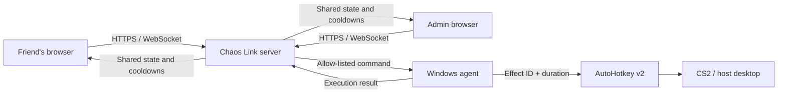

# Chaos Link

**Let your friends sabotage your CS2 session from their phones in real time.**

[](https://github.com/egore4606/chaos-link/actions/workflows/ci.yml)
[](https://github.com/egore4606/chaos-link/releases/latest)
[](#requirements)

Chaos Link turns an ordinary game with friends into a shared chaos challenge. You run it on the consenting player's Windows PC, send the room link to your friends, and they use their phones or browsers to make the match harder at the worst possible moment: force a jump or reload, pull out the knife, jerk the aim, block movement, flash the screen, or trigger a random screamer. Everyone sees the same cooldowns, so the group plays against the victim rather than spamming disconnected controls.

> [!IMPORTANT]
> Chaos Link intentionally affects keyboard, mouse, screen, and audio input on the host PC. Install and run it only with the gaming-PC owner's informed permission. It has no autostart, hidden service, remote shell, DLL injection, or game-memory access.


## What your friends can do

- Any number of browser controllers in one room
- Server-authoritative cooldowns shared in real time
- Admin pause, per-effect cooldown controls, and 30-second guest blocks
- Nine allow-listed effects implemented through AutoHotkey v2
- Random screamer images and sounds from user-managed folders
- LAN access plus an optional temporary Cloudflare Quick Tunnel
- One-file Windows installer with Start, Stop, and Uninstall shortcuts
- Emergency input release from the admin panel or `Ctrl+Shift+F12`

## How it works



The browser never talks directly to AutoHotkey. It authenticates to the ASP.NET Core server, which validates the room and role, serializes state changes, and forwards accepted effect IDs to the single gaming-PC agent. See the [WebSocket protocol](docs/protocol.md) for message examples.

## Quick start for a gaming-PC host

1. Download `ChaosLink-Setup.exe` from the [latest release](https://github.com/egore4606/chaos-link/releases/latest).
2. Run the file, review the displayed actions, type `INSTALL`, and approve the UAC prompt.
3. Copy the printed public URL, room code, and **guest key** to your friends.
4. Keep the **admin key** private. Use the desktop shortcuts to stop or uninstall the session.

The installer places the application, a private .NET runtime, AutoHotkey v2, and `cloudflared` under `%LOCALAPPDATA%\ChaosLink`. It does not create an autostart entry or Windows service.

If the desktop shortcut is unavailable, run the standalone `ChaosLink-Uninstall.exe` from the release. It asks for confirmation, stops only the recorded Chaos Link processes, removes the dedicated firewall rule and shortcuts, then deletes the marked installation directory. It refuses to remove an unmarked or protected directory.

> [!NOTE]
> The generated `https://*.trycloudflare.com` address changes after each restart. Cloudflare Quick Tunnels are suitable for temporary sessions, not permanent production hosting.

## Requirements

### Ready-made installer

- A Windows PC with internet access during installation
- Permission to approve one UAC prompt for the input agent and LAN firewall rule
- A modern browser on each controller device

### Development

- [.NET SDK 9](https://dotnet.microsoft.com/download/dotnet/9.0)
- [Node.js 20 or newer](https://nodejs.org/)
- [AutoHotkey v2](https://www.autohotkey.com/) on the gaming PC

## Development setup

Build the web application:

```powershell
cd apps/web
npm ci
npm run lint
npm run build
```

Build the .NET solution:

```powershell
cd ../..
dotnet restore ChaosLink.sln
dotnet build ChaosLink.sln --configuration Release --no-restore
```

Start the server and agent in separate terminals:

```powershell
dotnet run --project apps/server --urls http://0.0.0.0:5075
dotnet run --project apps/agent
```

Open `http://localhost:5075` locally or `http://<gaming-pc-ip>:5075` on the same LAN.

The checked-in settings contain development-only credentials:

| Role | Development value | Configuration key |
| --- | --- | --- |
| Room | `K7M2` | `ChaosLink:RoomCode` |
| Guest | `friend-access` | `ChaosLink:ControllerToken` |
| Admin | `admin-access` | `ChaosLink:AdminToken` |
| Agent | `agent-secret` | `ChaosLink:AgentToken` |

> [!WARNING]
> Replace every development value before exposing a manually configured server to the internet. The release installer generates fresh random values automatically. Browser keys are kept in session storage only.

## Effects and controls

| Group | Effects |
| --- | --- |
| Quick actions | Draw knife, reload, jump, drop weapon |
| Controls | Mouse jerk, hold Ctrl, block WASD |
| Screen and audio | White flash, random screamer |

Place custom media in the installed `screamer\images` and `screamer\sounds` folders. The app picks an image and sound independently at activation time; empty folders use the built-in fallback.

The administrator can pause all effects, block a connected guest for 30 seconds, and set future shared cooldowns from 0 to 3600 seconds. Use `Ctrl+Shift+F12` on the gaming PC for an emergency release of held keys and temporary input blocks.

## Build the Windows installer

```powershell
.\scripts\build-portable-installer.ps1
```

The build writes `dist\ChaosLink-Setup.ps1` and `dist\ChaosLink-Uninstall.ps1`. When the `ps2exe` module is available, it also produces `dist\ChaosLink-Setup.exe` and `dist\ChaosLink-Uninstall.exe`. The PowerShell setup fallback runs with:

```powershell
powershell.exe -NoProfile -ExecutionPolicy Bypass -File .\dist\ChaosLink-Setup.ps1
```

For a manual local deployment with newly generated credentials:

```powershell
.\scripts\publish-chaos-link.ps1
.\scripts\start-chaos-link.ps1
# later
.\scripts\stop-chaos-link.ps1
```

Runtime credentials are written to `.runtime/access.json`, which is excluded from Git.

## Test

With the server running:

```powershell
node scripts/smoke-test.mjs
```

The smoke test connects one agent and two controllers, triggers an effect, verifies that both controllers receive the same cooldown, and confirms that an immediate duplicate trigger is rejected.

## Security and game policy

Chaos Link uses role-specific shared tokens and an allow-list of effect identifiers. Do not expose the agent endpoint separately, share the admin or agent key, or commit generated runtime files. Read [SECURITY.md](SECURITY.md) before operating a public endpoint or reporting a vulnerability.

Game and platform policies can change, and no third-party input automation can guarantee anti-cheat compatibility. Prefer private or community games, keep CS2 Trusted Mode enabled, and stop the tool before entering environments where automation is prohibited.

## Project structure

```text
apps/server/     ASP.NET Core WebSocket server and room state
apps/web/        React + Vite responsive controller UI
apps/agent/      .NET gaming-PC agent
ahk/             AutoHotkey v2 allow-listed effect runner
installer/       Transparent portable Windows setup payload
scripts/         Build, launch, stop, and smoke-test tools
docs/            Protocol notes and UI preview
```

## Contributing and support

Bug reports and focused improvements are welcome. Read [CONTRIBUTING.md](CONTRIBUTING.md), use [GitHub Issues](https://github.com/egore4606/chaos-link/issues) for reproducible bugs and feature proposals, and see [SUPPORT.md](SUPPORT.md) for usage questions.

No open-source license has been granted yet. Unless a license is added, the repository remains publicly viewable source with all rights reserved by its owner.
